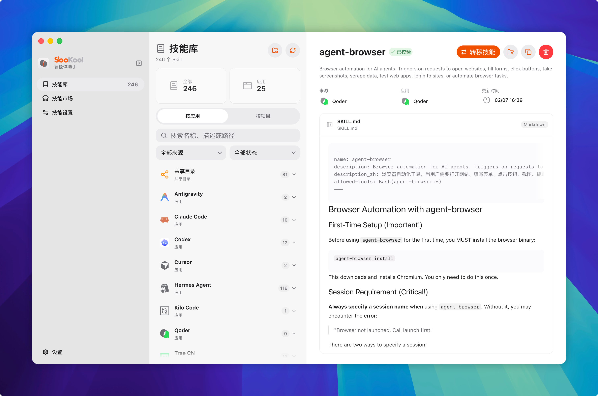
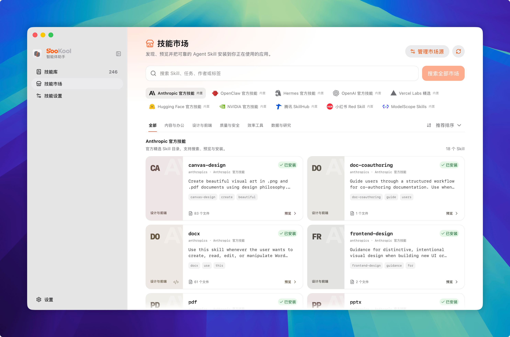

<div align="center">
  

  <h1>SooKool Agent Helper</h1>

  <p><strong>Agent Skills를 검색하고 정리하며 미리 보고 전송하고 설치하는 로컬 데스크톱 작업 공간입니다.</strong></p>

  <p>
    <a href="https://www.electronjs.org/"></a>
    <a href="https://react.dev/"></a>
    <a href="https://www.typescriptlang.org/"></a>
    <a href="../../LICENSE"></a>
  </p>
</div>

<div align="center">
  <a href="../../README.md">English</a> ·
  <a href="README.zh-CN.md">简体中文</a> ·
  <a href="README.zh-HK.md">繁體中文（香港）</a> ·
  <a href="README.ja.md">日本語</a> ·
  <a href="README.fr.md">Français</a> ·
  <strong>한국어</strong> ·
  <a href="README.es.md">Español</a> ·
  <a href="README.pt-BR.md">Português</a> ·
  <a href="README.ar.md">العربية</a>
</div>

## 개요

Agent 애플리케이션은 Skills를 서로 다른 시스템, 공유 및 프로젝트 디렉터리에 저장합니다. SooKool Agent Helper는 흩어진 위치를 하나의 라이브러리로 정리하고 통합 마켓을 제공합니다. 도구마다 다른 디렉터리 규칙을 외우거나 패키지를 직접 복사할 필요가 없습니다.

이 앱은 로컬 Agent Skill 관리에 집중합니다. 감지된 관련 앱과 유효한 디렉터리만 표시하며, 아직 내장되지 않은 도구는 사용자 지정 규칙으로 연결할 수 있습니다.

## 주요 기능

- **통합 Skill 라이브러리**: 공유 디렉터리를 중복 계산하지 않고 앱 또는 프로젝트별로 시스템 및 프로젝트 Skills를 탐색합니다.
- **풍부한 미리 보기**: 작업 전에 `SKILL.md`, Markdown, 스크립트, 이미지, 텍스트 및 메타데이터를 확인합니다.
- **앱 간 전송**: 시스템 또는 프로젝트 범위에서 지원되는 Agent 앱에 Skill을 추가하거나 제거합니다.
- **Skill 마켓**: 공식, 큐레이션 및 커뮤니티 소스를 한곳에서 검색하고 미리 보고 설치합니다.
- **유연한 검색**: 프로젝트와 스캔 위치를 등록하고 사용자 지정 앱 디렉터리 규칙을 정의합니다.
- **로컬 보호 기능**: 경로 확인 및 복사, 위험 콘텐츠 경고, Skill 삭제 시 백업을 지원합니다.
- **다국어 UI**: 영어, 중국어 간체와 번체(홍콩), 일본어, 프랑스어, 한국어, 스페인어, 브라질 포르투갈어, 아랍어.

## 스크린샷

<table>
  <tr>
    <td width="50%"></td>
    <td width="50%"></td>
  </tr>
  <tr>
    <td align="center"><strong>Skill 라이브러리</strong></td>
    <td align="center"><strong>Skill 마켓</strong></td>
  </tr>
</table>

## 생태계 지원

Codex, Claude Code, Cursor, Gemini CLI, GitHub Copilot, OpenCode, OpenClaw, Hermes Agent, Kilo Code, Qoder, Qwen Code, Trae, Windsurf 등 다양한 Agent 도구의 디렉터리 규칙이 내장되어 있습니다. 기본 라이브러리에는 로컬에서 감지된 앱과 유효한 Skill 위치만 표시됩니다. 추가 도구는 사용자 지정 규칙으로 연결할 수 있습니다.

마켓에는 Anthropic, OpenAI, OpenClaw, Hermes, Vercel Labs, Hugging Face, NVIDIA, Tencent SkillHub, Red Skill, ModelScope Skills 및 ClawHub가 포함됩니다. Git 저장소, 로컬 디렉터리와 호환되는 사용자 지정 소스도 추가할 수 있습니다.

## 시작하기

### 필수 항목

- Node.js 및 npm
- Git

### 소스에서 실행

```bash
git clone https://github.com/Zhiyuan20002/SooKool-Agent-Helper.git
cd SooKool-Agent-Helper
npm install
npm run dev
```

## 개발

| 명령                | 설명                              |
| ------------------- | --------------------------------- |
| `npm run dev`       | Electron 개발 환경 시작           |
| `npm run typecheck` | 메인 및 렌더러 프로세스 타입 검사 |
| `npm test`          | 자동 테스트 실행                  |
| `npm run build`     | 타입 검사 후 프로덕션 빌드 생성   |
| `npm run dist:mac`  | macOS 앱 패키징                   |
| `npm run dist:win`  | Windows 앱 패키징                 |

Linux 패키징 설정도 `electron-builder.yml`에 포함되어 있습니다.

## 프로젝트 구조

```text
src/main/       Electron 메인 프로세스, Skill 검색, 저장소 및 마켓
src/preload/    메인 프로세스와 렌더러 사이의 타입 안전 브리지
src/renderer/   React UI, 상태, 현지화 및 미리 보기
resources/      앱 아이콘 및 패키징 리소스
scripts/        빌드 검증 및 마켓 벤치마크
```

## 보안

SooKool Agent Helper는 자동 감지되거나 명시적으로 설정한 Skill 위치만 관리합니다. 온라인 마켓과 원격 저장소를 불러올 때 네트워크 연결이 필요합니다. 설치하기 전에 경고, 스크립트, 바이너리 파일 및 소스의 신뢰성을 확인하세요.

보안에 민감한 문제는 공개 Issue에 악용 세부 정보를 게시하지 말고 저장소 소유자에게 비공개로 알려 주세요.

## 기여

Issue와 Pull Request를 환영합니다. 코드 변경 시:

1. 저장소를 Fork하고 목적이 명확한 브랜치를 만듭니다.
2. 변경 범위를 유지하고 동작 변경에는 테스트를 추가합니다.
3. `npm run typecheck`와 `npm test`를 실행합니다.
4. 문제, 해결 방법 및 검증 내용을 설명하는 Pull Request를 엽니다.

## 라이선스

SooKool Agent Helper는 [MIT 라이선스](../../LICENSE)로 배포됩니다.
